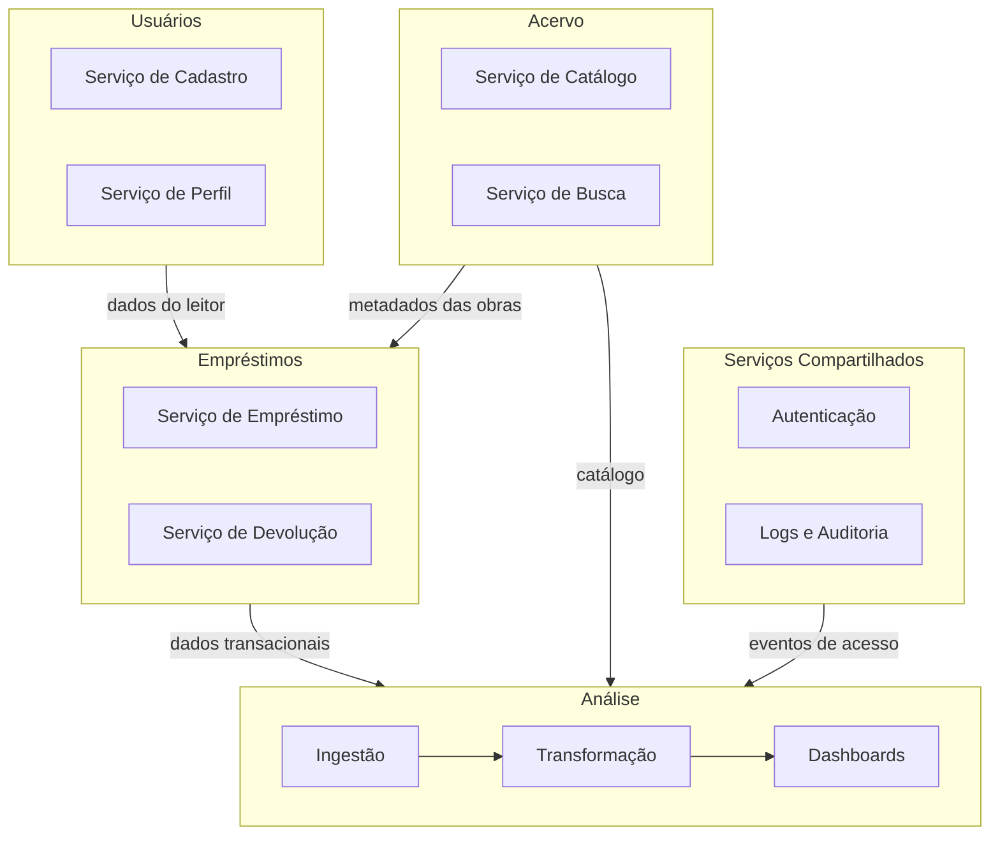
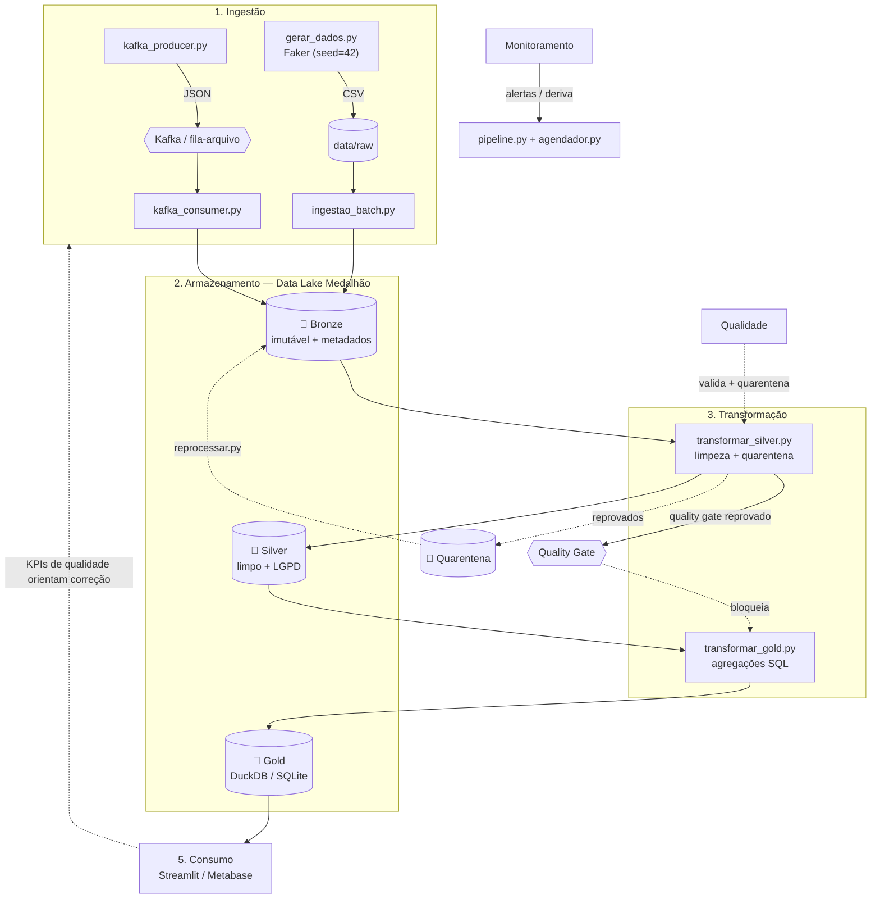

# 📚 BiblioData — Ciclo de Vida de Engenharia de Dados

**Centro Universitário de Brasília — CEUB** · Disciplina: **Engenharia de Dados**
**Repositório:** https://github.com/IsaPoppi/BiblioData
**Integrantes:** Isadora Almeida Poppi Barbosa (22302370) · Gabriel Almeida Poppi Durante (22302431)

Protótipo **funcional** do ciclo de vida de engenharia de dados de uma
biblioteca digital, cobrindo **Ingestão → Armazenamento → Transformação →
Orquestração → Consumo**, com as correntes transversais de **Qualidade,
Segurança, Governança e Monitoramento** integradas a cada etapa.

> Este projeto evoluiu do planejamento (Parte 1) para a implementação executável
> (Parte 2). As seções 1–6 descrevem **o quê e o porquê**; as seções 7–12
> mostram **como rodar** e o que foi **efetivamente implementado (as-built)**.

---

## 🖼️ Demonstração

Painel analítico construído com Streamlit, lendo a camada Gold e os logs de monitoramento.

**Visão geral — KPIs, rankings e séries:**


**Qualidade & Monitoramento — status, taxa de qualidade, quarentena e alertas:**


---

## Sumário
1. [Descrição do Projeto](#1-descrição-do-projeto)
2. [Definição e Classificação dos Dados](#2-definição-e-classificação-dos-dados)
3. [Domínios e Serviços](#3-domínios-e-serviços)
4. [Arquitetura — Fluxo de Dados](#4-arquitetura--fluxo-de-dados)
5. [Tecnologias — Justificativa por Etapa](#5-tecnologias--justificativa-por-etapa)
6. [Correntes do Ciclo: Qualidade, Segurança, Governança e Monitoramento](#6-correntes-do-ciclo-qualidade-segurança-governança-e-monitoramento)
7. [Como Rodar (Reprodução)](#7-como-rodar-reprodução)
8. [Testes, Agendamento e Reprocessamento](#8-testes-agendamento-e-reprocessamento)
9. [Arquitetura As-Built e Relatório de Mudanças](#9-arquitetura-as-built-e-relatório-de-mudanças)
10. [Mapeamento com os Critérios de Avaliação](#10-mapeamento-com-os-critérios-de-avaliação)
11. [Estrutura do Repositório](#11-estrutura-do-repositório)
12. [Considerações Finais](#12-considerações-finais)

---

## 1. Descrição do Projeto

### Nome e contexto de negócio
**BiblioData.** Simula o ciclo de vida de dados de uma **biblioteca digital** —
plataforma que oferece acesso a livros, artigos e periódicos eletrônicos. Os
usuários realizam empréstimos virtuais, pesquisam o acervo, avaliam títulos e
navegam por recomendações, via navegador web e aplicativo mobile.

### Problema e objetivos
A biblioteca digital **não possui um sistema centralizado de análise**. As
informações de uso, acervo, empréstimos e avaliações ficam dispersas, impedindo
decisões orientadas por dados. O objetivo é construir um **pipeline unificado**
que ingere dados **batch e streaming**, trata-os com integridade e os
disponibiliza, prontos para consumo, em um painel analítico.

Objetivos principais:
- Unificar fontes operacionais (batch) e eventos de acesso (streaming) num mesmo fluxo.
- Garantir **qualidade, governança e rastreabilidade** do dado de ponta a ponta.
- Entregar valor analítico: rankings de acervo, uso por gênero, comportamento de acesso.

### Stakeholders / usuários finais
- **Equipe de dados/BI** da biblioteca (consome o painel e as tabelas Gold).
- **Gestores do acervo** (decisões de compra com base no uso e nas avaliações).
- **Equipe de produto** (recomendações a partir do comportamento de acesso).
- **Encarregado de dados (DPO)** (conformidade LGPD sobre dados de usuários).

---

## 2. Definição e Classificação dos Dados

### Fontes de dados (implementadas)

| Fonte | Descrição | Formato origem | Volume (protótipo) | Frequência | Latência |
|---|---|---|---|---|---|
| Catálogo do Acervo (`livros`) | Metadados das obras: título, autor, ISBN, gênero, editora, ano | CSV | ~5.000 | Batch semanal | até 7 dias |
| Usuários (`usuarios`) | Cadastro: nome, e-mail, cidade, data de registro | CSV | ~10.000 | Batch diário | até 24 h |
| Empréstimos (`emprestimos`) | Histórico transacional de empréstimos e devoluções | CSV | ~20.000 | Batch diário | até 24 h |
| Avaliações (`avaliacoes`) | Notas (1–5) e comentários após a leitura | CSV | ~4.000 | Batch diário | até 24 h |
| Logs de Acesso (`acessos`) | Eventos de busca, clique e visualização | JSON | ~2.000 / execução | Streaming contínuo | segundos |

> Volumes parametrizáveis em `config/settings.py` (ou `.env`). Os dados são
> **sintéticos**, gerados com `Faker` e seed fixo para reprodutibilidade.

### Classificação explícita

**Dados operacionais (batch)** — gerados por processos transacionais, estruturados:

| Fonte | Tipo | Estrutura |
|---|---|---|
| Empréstimos | Transacional / histórico | Estruturado |
| Catálogo do Acervo | Mestre (referência) | Estruturado |
| Usuários | Cadastral | Estruturado |
| Avaliações | Transacional | Estruturado |

Características: volume moderado, latência aceitável (horas), processamento em lotes.

**Dados de streaming (tempo real)** — eventos contínuos da interação do usuário:

| Fonte | Tipo | Estrutura |
|---|---|---|
| Logs de Acesso | Evento (busca/clique/visualização) | Semiestruturado (JSON) |

Características: alto volume, baixa latência (segundos), processamento à medida que chega.

---

## 3. Domínios e Serviços

| Domínio | Serviços | Responsabilidade |
|---|---|---|
| **Usuários** | Cadastro, Perfil | Gerenciar leitores e seus dados |
| **Acervo** | Catálogo, Busca | Manter e pesquisar as obras |
| **Empréstimos** | Empréstimo, Devolução | Controlar o fluxo transacional |
| **Análise** | Ingestão, Transformação, Dashboards | Tratar e disponibilizar dados para consumo |
| **Compartilhados** | Autenticação, Logs e Auditoria | Serviços usados por todos os domínios |



---

## 4. Arquitetura — Fluxo de Dados

### Tipo de arquitetura e justificativa
**Arquitetura Medalhão (Lakehouse)** com **caminhos batch e streaming**
(inspiração Lambda). As camadas **Bronze → Silver → Gold** separam o dado bruto
(auditável e imutável) do limpo e do agregado/curado. Foi escolhida porque:
- isola responsabilidades e permite **reprocessar** sem perder a origem;
- comporta naturalmente **batch e streaming** no mesmo pipeline;
- é **simples de executar** (roda em qualquer laptop), adequada a um protótipo.

### Fluxo ponta a ponta (as-built)



**Caminho batch:** Faker gera CSVs → `ingestao_batch` salva em Bronze (Parquet) →
`transformar_silver` limpa e aplica LGPD → `transformar_gold` agrega (SQL).

**Caminho streaming:** `kafka_producer` publica eventos de acesso → `kafka_consumer`
grava na Bronze → seguem o mesmo fluxo Silver/Gold.

### Trade-offs das decisões

| Aspecto | Decisão | Impacto / Justificativa |
|---|---|---|
| **Acoplamento** | Baixo — produtor e consumidor desacoplados (Kafka/fila) | Evoluir cada parte de forma independente |
| **Escalabilidade** | Média — pandas até ~1 GB | Aceitável para protótipo; substituível por Spark |
| **Disponibilidade** | Baixa — armazenamento local | Aceitável para escopo acadêmico |
| **Confiabilidade** | Média/Alta — retries + quality gates + quarentena | Falhas não corrompem a Gold |
| **Reversibilidade** | Alta — Bronze imutável | Qualquer reprocessamento parte da origem |
| **Simplicidade** | Muito Alta — sem Java, executável em qualquer laptop | Fácil de implementar e apresentar |

---

## 5. Tecnologias — Justificativa por Etapa

Para cada etapa, **o quê**, **por quê** e **como se integra**. Todos os backends
de produção têm **fallback automático**, garantindo execução em qualquer máquina.

### Ingestão — Faker + Kafka (Redpanda) / fila em arquivo
- **Faker** gera dados sintéticos realistas com seed fixo (reprodutibilidade), eliminando dependência de dados reais.
- **Kafka (Redpanda)** desacopla a geração de eventos do processamento (streaming). Redpanda é compatível com Kafka, porém sem Zookeeper/Java — mais leve.
- *Integração:* o produtor publica eventos JSON; o consumidor grava na Bronze. Sem broker, ambos caem para uma **fila em arquivo**, mantendo a mesma semântica.

### Armazenamento — Data Lake Medalhão (Parquet / CSV)
- **Parquet** (colunar, compacto) nas camadas Bronze/Silver; **CSV** como fallback.
- *Por quê:* formato padrão de Data Lake, eficiente para leitura analítica.
- *Integração:* a abstração `src/storage.py` lê/grava sem o resto do código saber o formato; a Bronze recebe colunas de controle (data de ingestão, fonte).

### Transformação — pandas + DuckDB / SQLite
- **pandas** na Silver (limpeza, deduplicação, normalização de tipos, LGPD).
- **DuckDB** na Gold (SQL analítico embarcado, sem servidor); **SQLite** como fallback.
- *Por quê:* leves, sem infraestrutura; DuckDB executa agregações SQL muito rápido sobre Parquet.
- *Integração:* a Silver alimenta a Gold; o engine é escolhido automaticamente.

### Orquestração — pipeline.py + agendador.py
- **`pipeline.py`**: encadeia as tarefas (mini-DAG) com **retries**, **quality gates** e coleta de métricas.
- **`agendador.py`**: cobre o **agendamento** (intervalo ou cron), com fallback em biblioteca padrão.
- *Por quê não Airflow:* peso desproporcional para um protótipo; a rubrica aceita "um script". A mesma semântica (dependências, retries, observabilidade) foi implementada de forma enxuta, com migração futura direta.

### Consumo (Serving) — Streamlit / Metabase
- **Streamlit** (painel primário): instala via `pip`, sem Java; exibe KPIs, rankings, série temporal e um **painel de observabilidade**.
- **Metabase** disponível como opção no `docker-compose`.
- *Integração:* lê as tabelas Gold (DuckDB/SQLite) e os logs de monitoramento.

---

## 6. Correntes do Ciclo: Qualidade, Segurança, Governança e Monitoramento

Estas camadas atravessam todo o pipeline e foram a principal evolução em relação ao plano.

- **Qualidade** (`src/quality/`): motor de regras derivado de **contratos de dados** (`config/data_contracts.py`) — not_null, unique, FK, faixa, regex, freshness. Registros reprovados vão para a **quarentena** (`data/quarantine/`). Papel análogo ao do Soda Core / Great Expectations.
- **Segurança / LGPD** (`src/governance/privacy.py`): PII (nome, e-mail) é **pseudonimizada/mascarada** já na Silver; o sal vem do `.env` (fora do código); a Gold expõe **apenas agregados**. A Bronze (com o dado original) é auditável e de acesso restrito.
- **Governança** (`src/governance/`): **catálogo/dicionário de dados** automático, **linhagem** (origem→bronze→silver→gold) e detecção de **deriva de schema**. Saídas em `catalog/`.
- **Monitoramento** (`src/monitoring/`): **logging estruturado**, **métricas por execução** (linhas in/out, duração, taxa de qualidade, quarentena), **alertas** e detecção de **deriva de volume**. Saídas em `logs/`.

**Retroalimentações (o ciclo, não só o caminho feliz):**
1. Qualidade → **quarentena** (nada é descartado em silêncio).
2. **Quality gate** → bloqueia a promoção para a Gold quando a qualidade cai.
3. Monitoramento → **alertas** e deriva de volume/schema.
4. **`reprocessar.py`** → registros corrigidos voltam ao pipeline.
5. Bronze imutável → permite **reprocessar** do zero.

---

## 7. Como Rodar (Reprodução)

```bash
# 1. Ambiente (uma única vez)
python -m venv .venv
.venv\Scripts\activate          # Windows  (Linux/Mac: source .venv/bin/activate)

# 2. Dependências (sem versão fixa, para evitar conflitos de resolução)
python -m pip install faker pyarrow duckdb kafka-python streamlit pytest apscheduler

# 3. Pipeline completo: gera dados -> Bronze -> Silver -> Gold -> catálogo
python pipeline.py

# 4. Painel de consumo (KPIs + monitoramento)
python -m streamlit run src/serving/dashboard.py
```

**Sem instalar nada pesado?** O pipeline tem **fallback automático**: sem
`pyarrow`/`duckdb`/`kafka`, opera com **CSV + SQLite + fila em arquivo** (só
`pandas` + biblioteca padrão).

**Caminho de produção (Kafka real + Metabase):**
```bash
docker compose up -d
set STREAM_BACKEND=kafka         # Windows (export no Linux/Mac)
python pipeline.py
```

---

## 8. Testes, Agendamento e Reprocessamento

```bash
pytest -q                                  # 9 testes (qualidade, LGPD, pipeline, gate)
python agendador.py --once                 # agendamento: uma vez
python agendador.py --intervalo 3600       # a cada 1 h (stdlib, sem deps)
python reprocessar.py listar               # ver a quarentena
python reprocessar.py usuarios             # revalidar e reintegrar recuperáveis
```

---

## 9. Arquitetura As-Built e Relatório de Mudanças

O feedback da Parte 1 apontou que a arquitetura estava organizada, mas
**faltavam monitoramento, governança e qualidade**, e que o desenho **só cobria
o caminho feliz, sem retroalimentações**. A Parte 2 endereça exatamente isso.

| # | Mudança em relação ao plano | Justificativa técnica |
|---|---|---|
| 1 | **+ Camada de Qualidade** (contratos + checks + quarentena) | O plano não tinha validação; sem ela, dado ruim chega ao consumo |
| 2 | **+ Camada de Governança** (catálogo, linhagem, LGPD) | Rastreabilidade, auditabilidade e conformidade |
| 3 | **+ Camada de Monitoramento** (logs, métricas, alertas, deriva) | Observabilidade ausente no plano |
| 4 | **+ Retroalimentações** (quality gate, quarentena, reprocessamento, retries) | Resposta ao "só caminho feliz" |
| 5 | **Orquestração:** `pipeline.py` + `agendador.py` no lugar do Airflow | Airflow é pesado para protótipo; rubrica aceita script |
| 6 | **Streaming:** Redpanda + **fallback** para fila em arquivo | Menos infra; roda sem Docker; resiliência se o broker cair |
| 7 | **Consumo:** Streamlit primário (Metabase opcional) | Instala via pip, sem Java; ainda mostra KPIs de qualidade |
| 8 | **Gold:** DuckDB com fallback SQLite; novas tabelas | Roda em qualquer ambiente; painel mais rico |
| 9 | **Dados sintéticos realistas** (qualidade + popularidade latentes) | Rankings com significado; valida o pipeline contra dado imperfeito |
| 10 | **+ Testes automatizados** (`pytest`) | Critério de engenharia de software; evita regressões |

Decisões originais mantidas: medalhão Bronze/Silver/Gold, batch + streaming, seed fixo.

---

## 10. Mapeamento com os Critérios de Avaliação

**a. Funcionalidade e Operacionalidade**
- **Pipeline (Ingestão/Armazenamento/Transformação):** `src/ingestion/`, `src/storage.py`, `src/transform/` — executa via `python pipeline.py`.
- **Entrega de Valor (Consumo):** `src/serving/dashboard.py` + `src/serving/queries.sql` + tabelas Gold.
- **Ciclo (Qualidade, Segurança, Governança, Monitoramento):** `src/quality/`, `src/governance/`, `src/monitoring/` (ver seção 6).

**b. Arquitetura As-Built:** diagrama atualizado (seção 4 e 9) + relatório de mudanças (seção 9).

**c. Organização, Documentação e Defesa:** estrutura por responsabilidade (seção 11), este README com reprodução e justificativas, docstrings em todos os módulos, testes automatizados.

---

## 11. Estrutura do Repositório

```
bibliodata/
├── README.md                ← este documento (descrição + as-built + mudanças)
├── conftest.py              ← configuração do pytest
├── pipeline.py              ← orquestrador (DAG, retries, quality gates)
├── agendador.py             ← agendamento (intervalo/cron, fallback stdlib)
├── reprocessar.py           ← reprocessamento da quarentena (retroalimentação)
├── docker-compose.yml       ← Redpanda (Kafka) + Metabase (opcional)
├── requirements.txt · .env.example · Makefile
├── config/
│   ├── settings.py          ← config central + auto-detecção de backends
│   └── data_contracts.py    ← schemas, PII e expectativas (base da governança)
├── src/
│   ├── storage.py           ← abstração do Data Lake (Parquet/CSV) + quarentena
│   ├── ingestion/           ← geração, ingestão batch e streaming
│   ├── transform/           ← Silver e Gold
│   ├── quality/             ← motor de regras de qualidade
│   ├── governance/          ← catálogo, linhagem, LGPD
│   ├── monitoring/          ← logger e métricas/alertas
│   └── serving/             ← dashboard Streamlit + queries.sql
├── tests/                   ← testes automatizados (pytest)
├── data/                    ← raw/ bronze/ silver/ gold/ quarantine/ stream_queue/
├── catalog/                 ← dicionário, linhagem e perfil (gerados)
├── logs/                    ← logs e métricas por execução (gerados)
└── notebooks/               ← análise exploratória
```

---

## 12. Considerações Finais

### Riscos e limitações
- **Dados sintéticos:** as tendências são simuladas; o valor está no *pipeline*, não nos números.
- **Escala:** pandas é adequado a ~1 GB; volumes maiores exigiriam Spark.
- **Disponibilidade:** armazenamento local, sem redundância (escopo acadêmico).
- **Segurança:** concentrada em LGPD (pseudonimização) e gestão de segredo via `.env`; controle de acesso fino ficaria para produção.

### Próximos passos (evolução)
- Migrar a orquestração para Airflow/Prefect e o processamento para Spark.
- Adotar Soda Core ou Great Expectations no lugar do motor de qualidade próprio.
- Particionamento da Bronze por data e CI (GitHub Actions) rodando os testes.

### Referências
- Conceitos de ciclo de vida de engenharia de dados e arquitetura medalhão vistos em aula.
- Documentação oficial de pandas, DuckDB, Apache Kafka/Redpanda, Streamlit e Faker.
- LGPD (Lei nº 13.709/2018) para o tratamento de dados pessoais.
