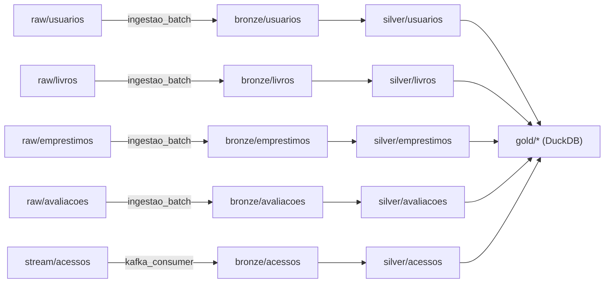

# 📚 BiblioData — Ciclo de Vida de Engenharia de Dados (Parte 2)

**Centro Universitário de Brasília — CEUB**
**Disciplina:** Engenharia de Dados
**Avaliação:** Projeto Parte 2 — Implementação e Refinamento do Protótipo
**Integrantes:** Isadora Almeida Poppi Barbosa (22302370) · Gabriel Almeida Poppi Durante (22302431)

Protótipo funcional do ciclo de vida de dados de uma **biblioteca digital**. O
pipeline cobre, ponta a ponta, **Ingestão → Armazenamento → Transformação →
Orquestração → Consumo**, com as camadas transversais de **Qualidade,
Governança, Segurança e Monitoramento** integradas a cada etapa.

> **Diferencial desta entrega:** o protótipo não testa só o "caminho feliz".
> Dados sujos são injetados de propósito, capturados pela camada de qualidade e
> desviados para uma **quarentena**; um **quality gate** impede que dados ruins
> cheguem ao consumo; e tudo é observável via logs, métricas e um painel.

---

## Como rodar (reprodução)

```bash
# 1. Ambiente
python -m venv .venv && source .venv/bin/activate   # Windows: .venv\Scripts\activate
pip install -r requirements.txt

# 2. Pipeline completo (Faker -> Bronze -> Silver -> Gold -> Catálogo)
python pipeline.py

# 3. Painel de consumo (KPIs + monitoramento)
python -m streamlit run src/serving/dashboard.py     

#4Testes Automatizados

python -m pytest -q
```

Atalhos via `make`: `make run`, `make run-small`, `make dash`, `make test-gate`, `make clean`.

### Sem instalar nada de pesado?
O pipeline tem **fallback automático**. Se `pyarrow`, `duckdb` ou `kafka` não
estiverem disponíveis, ele roda com **CSV + SQLite + fila em arquivo** usando só
`pandas` + biblioteca padrão. Isso garante reprodução em qualquer máquina.

### Caminho de produção (Kafka real + Metabase)
```bash
docker compose up -d            # sobe Redpanda (Kafka) + Metabase
export STREAM_BACKEND=kafka
python pipeline.py
```

---

## Testes, agendamento e reprocessamento

### Testes automatizados
```bash
python -m pytest -q
```
Cobrem o motor de qualidade (e-mail inválido, duplicata, FK órfã, nota fora da
faixa), a pseudonimização LGPD, o pipeline ponta a ponta e o bloqueio do
quality gate. Os testes rodam no modo fallback (sem Kafka/Docker).

### Agendamento (orquestração)
Além do encadeamento em `pipeline.py`, o `agendador.py` cobre o agendamento:
```bash
python agendador.py --once               # uma vez
python agendador.py --intervalo 3600     # a cada 1 hora (stdlib, sem deps)
python agendador.py --cron "0 3 * * *"   # 03:00 diário (requer apscheduler)
```
Em produção também pode-se agendar via Agendador de Tarefas do Windows ou cron
chamando `pipeline.py` (ver docstring do `agendador.py`).

### Reprocessamento da quarentena (retroalimentação)
Fecha o ciclo de qualidade: registros desviados podem ser triados e, uma vez
corrigidos, reintegrados à Bronze.
```bash
python reprocessar.py listar             # mostra o que está em quarentena
python reprocessar.py usuarios           # revalida e reintegra os recuperáveis
```
Os que voltam a ser válidos são anexados à Bronze (append-only) e promovidos no
próximo run; os que ainda falham retornam à quarentena.

---

## Arquitetura As-Built (o que foi efetivamente implementado)

```mermaid
flowchart TB
    subgraph ING["1. Ingestão"]
        FK["gerar_dados.py<br/>Faker pt_BR (seed=42)"] -->|CSV| RAW[(data/raw)]
        RAW --> IB["ingestao_batch.py"]
        KP["kafka_producer.py<br/>eventos de acesso"] -->|JSON| Q{{"Kafka / fila-arquivo"}}
        Q --> KC["kafka_consumer.py"]
    end

    subgraph LAKE["2. Armazenamento — Data Lake Medalhão"]
        BR[("🥉 Bronze<br/>imutável + metadados")]
        SI[("🥈 Silver<br/>limpo + LGPD")]
        GO[("🥇 Gold<br/>DuckDB / SQLite")]
    end

    subgraph TRANS["3. Transformação"]
        TS["transformar_silver.py<br/>limpeza + quarentena"]
        TG["transformar_gold.py<br/>agregações SQL"]
    end

    subgraph SERV["5. Consumo"]
        DASH["Streamlit / Metabase<br/>KPIs + observabilidade"]
    end

    IB --> BR
    KC --> BR
    BR --> TS --> SI --> TG --> GO --> DASH

    subgraph QUAL["⚙️ Camadas transversais"]
        QC["Qualidade<br/>contratos + checks"]
        GOV["Governança<br/>catálogo · linhagem · LGPD"]
        MON["Monitoramento<br/>logs · métricas · alertas"]
    end

    QC -. valida .-> IB
    QC -. valida + quarentena .-> TS
    QUAR[("🚧 Quarentena")]
    TS -.->|registros reprovados| QUAR

    %% RETROALIMENTAÇÕES
    TS -->|"quality gate reprovado<br/>BLOQUEIA promoção"| GATE{{"Quality Gate"}}
    GATE -. impede .-> TG
    MON -->|deriva de volume / schema<br/>alertas| ORQ["pipeline.py<br/>orquestrador + retries"]
    QUAR -.->|reprocessar a partir da Bronze| BR
    DASH -.->|KPIs de qualidade<br/>orientam correção| ING

    ORQ -.-> ING
    ORQ -.-> TRANS
    GOV -.-> LAKE
    MON -.-> LAKE
```



### Linhagem real (gerada automaticamente em `catalog/lineage.json`)



---

## Relatório de Mudanças (Plano da Parte 1 → As-Built)

O feedback da Parte 1 apontou que a arquitetura estava organizada, mas **faltavam
monitoramento, governança e qualidade**, e que o desenho **só cobria o caminho
feliz, sem retroalimentações**. A Parte 2 endereça exatamente isso. Resumo:

| # | Mudança | Motivação técnica |
|---|---------|-------------------|
| 1 | **Adicionada camada de Qualidade** (`src/quality`): contratos de dados + motor de regras (not_null, unique, FK, range, regex, freshness) + **quarentena** de registros reprovados. | O plano não tinha validação. Sem ela, dados ruins se propagam até o consumo. |
| 2 | **Adicionada camada de Governança** (`src/governance`): catálogo/dicionário de dados automático, **linhagem** (origem→bronze→silver→gold) e **LGPD** (pseudonimização de nome, mascaramento de e-mail). | Atende rastreabilidade, auditabilidade e conformidade — ausentes no plano. |
| 3 | **Adicionada camada de Monitoramento** (`src/monitoring`): logging estruturado, métricas por execução (linhas in/out, duração, taxa de qualidade, quarentena), **alertas** e detecção de **deriva de volume/schema**. | Não havia observabilidade. Agora cada run é auditável em `logs/`. |
| 4 | **Retroalimentações explícitas:** (a) qualidade → **quarentena**; (b) **quality gate** que bloqueia a promoção para a Gold; (c) monitoramento → alertas/deriva; (d) Bronze imutável permite **reprocessamento**; (e) painel expõe KPIs de qualidade. | Resposta direta ao "faltou retroalimentação / só caminho feliz". |
| 5 | **Orquestração:** orquestrador próprio (`pipeline.py`) com mini-DAG, **retries com backoff** e quality gates, no lugar do Airflow. | Airflow é pesado demais para um protótipo de laptop; a mesma semântica (dependências, retries, observabilidade) foi implementada de forma enxuta. Migração para Airflow/Prefect fica como evolução. |
| 6 | **Streaming:** Kafka mantido, mas via **Redpanda** (compatível com Kafka, sem Zookeeper/Java) e com **fallback de fila em arquivo**. | Reduz a dependência de infra e garante execução sem Docker, mantendo a semântica produtor/consumidor desacoplados. |
| 7 | **Consumo:** **Streamlit** como painel primário (instala via `pip`, sem Java), com **Metabase** mantido como opção no `docker-compose`. | O plano citava Metabase; Streamlit baixa a barreira de execução e ainda exibe o painel de observabilidade. |
| 8 | **Gold:** DuckDB mantido como engine de produção, com **fallback SQLite**. | Permite rodar as agregações SQL em ambientes sem DuckDB. |
| 9 | **Robustez:** geração de dados injeta registros inválidos de propósito; todos os backends degradam graciosamente. | Para validar o pipeline contra dados reais e imperfeitos, não só o cenário ideal. |

As decisões de arquitetura originais (medalhão Bronze/Silver/Gold, batch + streaming,
seed fixo para reprodutibilidade) **foram mantidas**.

---

## Mapeamento com os critérios da avaliação

**a. Implementação Prática**
- **Ingestão:** `src/ingestion/` — `gerar_dados.py` (Faker→CSV), `ingestao_batch.py` (CSV→Bronze), `kafka_producer.py` / `kafka_consumer.py` (streaming).
- **Armazenamento:** Data Lake medalhão em `data/` (Bronze/Silver/Gold) + `docker-compose.yml`.
- **Transformação:** `src/transform/` — Silver (limpeza, quarentena, LGPD) e Gold (agregações SQL).
- **Orquestração:** `pipeline.py` (DAG sequencial, retries, quality gates).
- **Consumo:** `src/serving/dashboard.py` (Streamlit) + `queries.sql`.

**Ciclo (Qualidade, Segurança, Governança, Monitoramento):**
- Qualidade → `src/quality/` + quarentena.
- Segurança/LGPD → `src/governance/privacy.py` (PII nunca em claro na Silver/Gold).
- Governança → `src/governance/catalog.py`, `lineage.py` → saídas em `catalog/`.
- Monitoramento → `src/monitoring/` → `logs/pipeline_metrics.jsonl`, `alerts.jsonl`.

**b. As-Built:** este README (diagrama atualizado + relatório de mudanças).

**c. Organização/Documentação:** estrutura de pastas por responsabilidade, docstrings em todos os módulos, instruções de reprodução acima, dicionário de dados gerado em `catalog/data_dictionary.md`.

---

## Estrutura do repositório

```
bibliodata/
├── README.md                ← este arquivo (as-built + mudanças)
├── pipeline.py              ← orquestrador (DAG, retries, quality gates)
├── docker-compose.yml       ← Redpanda (Kafka) + Metabase (opcional)
├── requirements.txt
├── .env.example
├── Makefile
├── config/
│   ├── settings.py          ← config central + auto-detecção de backends
│   └── data_contracts.py    ← schemas, PII e expectativas (base da governança)
├── src/
│   ├── storage.py           ← abstração do Data Lake (Parquet/CSV) + quarentena
│   ├── ingestion/           ← geração, ingestão batch e streaming
│   ├── transform/           ← Silver e Gold
│   ├── quality/             ← motor de regras de qualidade
│   ├── governance/          ← catálogo, linhagem, LGPD
│   ├── monitoring/          ← logger e métricas/alertas
│   └── serving/             ← dashboard Streamlit + queries.sql
├── data/                    ← raw/ bronze/ silver/ gold/ quarantine/ stream_queue/
├── catalog/                 ← dicionário, linhagem e perfil (gerados)
├── logs/                    ← logs e métricas por execução (gerados)
└── notebooks/
    └── analise_exploratoria.ipynb
```

---

## Stack

| Camada | Produção | Fallback |
|---|---|---|
| Geração | Faker | gerador stdlib |
| Armazenamento | Parquet (pyarrow) | CSV |
| Gold | DuckDB | SQLite |
| Streaming | Kafka (Redpanda) | fila em arquivo |
| Consumo | Streamlit / Metabase | — |
| Orquestração | `pipeline.py` | — |

Reprodutibilidade garantida por `Faker.seed(42)` e `random.seed(42)`.
