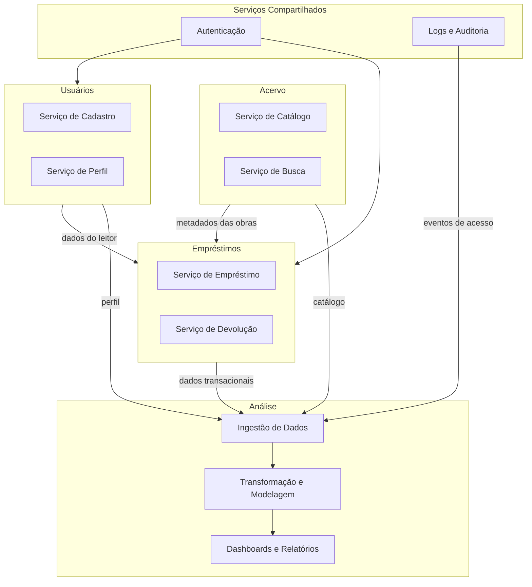
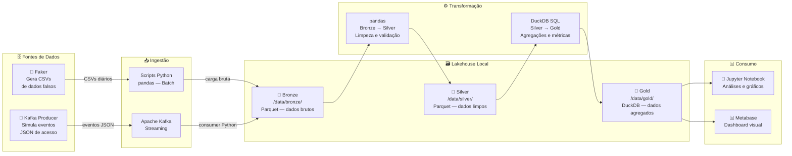
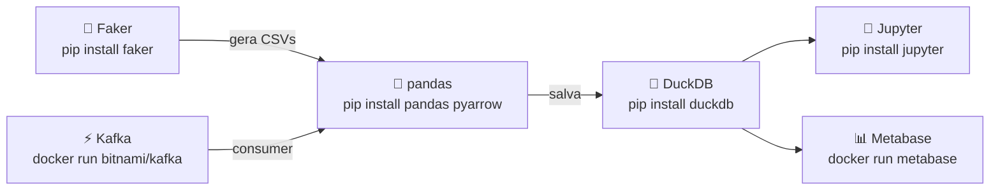

# 📚 BiblioData — Ciclo de Vida de Engenharia de Dados para Biblioteca Digital

> **Instituição:** Centro Universitário de Brasília — CEUB  
> **Disciplina:** Engenharia de Dados  
> **Avaliação:** Projeto Parte 1 — Planejamento Arquitetural  
> **Data de Entrega:** 30/04/2026  
> **Integrantes:**
> - Isadora Almeida Poppi Barbosa — Matrícula: 22302370
> - Gabriel Almeida Poppi Durante — Matrícula: 22302431

---

## Sumário

1. [Descrição do Projeto](#1-descrição-do-projeto)
2. [Definição e Classificação dos Dados](#2-definição-e-classificação-dos-dados)
3. [Domínios e Serviços](#3-domínios-e-serviços)
4. [Arquitetura — Fluxo de Dados](#4-arquitetura--fluxo-de-dados)
5. [Tecnologias — Como Será Feito](#5-tecnologias--como-será-feito)
6. [Considerações Finais](#6-considerações-finais)

---

## 1. Descrição do Projeto

### 1.1 Nome e Contexto de Negócio

**Nome do Projeto:** BiblioData

O projeto simula o ciclo de vida de engenharia de dados de uma **biblioteca digital**, plataforma que oferece acesso a livros, artigos e periódicos em formato eletrônico. Os usuários podem realizar empréstimos virtuais, pesquisar obras no acervo, avaliar títulos lidos e navegar por recomendações. A plataforma é acessada via navegador web e aplicativo mobile.

O cenário foi escolhido por ser simples de entender, possuir fontes de dados bem definidas (usuários, livros, empréstimos, eventos de acesso) e permitir demonstrar claramente os conceitos de ingestão batch e streaming dentro de um mesmo pipeline.

---

### 1.2 Problema que o Projeto Pretende Resolver

A biblioteca digital não possui um sistema centralizado de análise de dados. As informações de empréstimos, avaliações e acessos ficam isoladas em diferentes sistemas, o que impede que a gestão tome decisões baseadas em dados. Especificamente:

- Não há visibilidade sobre quais obras são mais emprestadas ou pesquisadas.
- Não é possível identificar padrões de uso por perfil de usuário, gênero literário ou período do ano.
- Decisões de aquisição de novas obras são tomadas de forma intuitiva, sem embasamento em dados históricos.
- Não existe monitoramento em tempo real dos eventos de acesso à plataforma.

**Solução proposta:** construir um pipeline de dados completo que colete, processe e disponibilize essas informações de forma centralizada, confiável e acessível à equipe de gestão.

---

### 1.3 Principais Stakeholders e Usuários Finais

| Perfil | Como usa os dados |
|---|---|
| **Gestores da Biblioteca** | Dashboards com indicadores de uso, tendências do acervo e apoio a decisões de aquisição |
| **Bibliotecários** | Relatórios de empréstimos ativos, obras mais demandadas e status do acervo |
| **Usuários (leitores)** | Histórico pessoal de leituras (futuro: recomendações personalizadas) |
| **TI / Engenharia** | Monitoramento dos pipelines de dados, qualidade e integridade dos dados |

---

## 2. Definição e Classificação dos Dados

> **Importante:** como se trata de um protótipo acadêmico, todos os dados serão gerados sinteticamente com a biblioteca **Faker (Python)**, simulando um ambiente realista sem necessidade de dados reais.

---

### 2.1 Fontes de Dados e Detalhamento

| Fonte | Descrição | Formato | Volume Estimado | Frequência | Latência |
|---|---|---|---|---|---|
| **Empréstimos** | Registros de empréstimos e devoluções realizados pelos usuários | CSV | ~500 registros/dia | Batch diário | Até 24h |
| **Catálogo do Acervo** | Metadados das obras: título, autor, ISBN, gênero, editora, ano | CSV | ~50.000 registros (estático) | Batch semanal | Até 7 dias |
| **Usuários** | Dados de cadastro: nome, e-mail, data de registro, cidade | CSV | ~10.000 usuários | Batch diário | Até 24h |
| **Logs de Acesso** | Eventos de busca, clique e visualização de página na plataforma | JSON | ~20.000 eventos/dia | Streaming contínuo | Segundos |
| **Avaliações** | Notas (1–5) e comentários deixados pelos usuários após a leitura | CSV | ~200 registros/dia | Batch diário | Até 24h |

---

### 2.2 Classificação dos Dados

#### 🗂️ Dados Operacionais (Batch)

São dados gerados por processos transacionais e armazenados de forma estruturada. No protótipo, serão gerados como arquivos CSV pelo Faker e extraídos periodicamente via scripts Python.

| Fonte | Tipo | Estrutura |
|---|---|---|
| Empréstimos | Transacional / histórico | Estruturado (linhas e colunas bem definidas) |
| Catálogo do Acervo | Dado mestre (referência) | Estruturado |
| Usuários | Cadastral | Estruturado |
| Avaliações | Transacional | Estruturado |

**Características:** volume moderado, baixa latência aceitável (horas), processamento em lotes diários ou semanais.

#### ⚡ Dados de Streaming (Tempo Real)

São eventos gerados de forma contínua pela interação dos usuários com a plataforma, processados assim que chegam.

| Fonte | Tipo | Estrutura |
|---|---|---|
| Logs de Acesso | Eventos de comportamento | Semi-estruturado (JSON) |

**Características:** alto volume, latência baixa exigida (segundos), gerados por um script Python que atua como produtor Kafka simulando o comportamento da aplicação web.

---

### 2.3 Exemplos de Campos por Fonte

**Empréstimos (`emprestimos.csv`):**
```
id_emprestimo, id_usuario, id_livro, data_emprestimo, data_devolucao, status
```

**Catálogo (`acervo.csv`):**
```
id_livro, titulo, autor, genero, editora, ano_publicacao, isbn, num_paginas
```

**Usuários (`usuarios.csv`):**
```
id_usuario, nome, email, cidade, data_cadastro
```

**Log de Acesso (evento JSON via Kafka):**
```json
{
  "evento_id": "abc123",
  "id_usuario": 42,
  "tipo_evento": "busca",
  "termo_buscado": "ficção científica",
  "timestamp": "2026-04-20T14:32:11Z"
}
```

**Avaliações (`avaliacoes.csv`):**
```
id_avaliacao, id_usuario, id_livro, nota, comentario, data_avaliacao
```

---

## 3. Domínios e Serviços

### 3.1 Identificação dos Domínios de Negócio

O projeto é organizado em **4 domínios de negócio** principais, cada um com responsabilidades bem delimitadas:

| Domínio | Responsabilidade Principal |
|---|---|
| **Acervo** | Gerenciar o catálogo de obras, seus metadados e disponibilidade |
| **Usuários** | Gerenciar o cadastro, perfil e histórico dos leitores |
| **Empréstimos** | Controlar o ciclo de empréstimo e devolução das obras |
| **Análise** | Ingerir, processar e disponibilizar dados para consumo analítico |

Além dos domínios principais, existem **serviços compartilhados** reutilizados entre domínios:

| Serviço Compartilhado | Usado por |
|---|---|
| **Autenticação** | Usuários, Empréstimos |
| **Logs e Auditoria** | Todos os domínios → alimenta o domínio de Análise |

---

### 3.2 Serviços por Domínio

**Domínio: Acervo**
- Serviço de Catálogo — mantém o registro de todas as obras disponíveis.
- Serviço de Busca — permite que usuários pesquisem obras por título, autor ou gênero.

**Domínio: Usuários**
- Serviço de Cadastro — gerencia criação e atualização de contas de leitores.
- Serviço de Perfil — armazena preferências e histórico do usuário.

**Domínio: Empréstimos**
- Serviço de Empréstimo — registra novas solicitações de empréstimo.
- Serviço de Devolução — registra devoluções e atualiza a disponibilidade da obra.

**Domínio: Análise**
- Serviço de Ingestão — coleta os dados dos outros domínios (batch e streaming).
- Serviço de Transformação — limpa, valida e agrega os dados em camadas.
- Serviço de Dashboards — disponibiliza os dados processados para consumo visual.

---

### 3.3 Diagrama de Domínios e Serviços



---

## 4. Arquitetura — Fluxo de Dados

### 4.1 Tipo de Arquitetura Escolhida

O projeto adota a **Arquitetura Lakehouse com o padrão Medalhão (Bronze → Silver → Gold)**, combinando um caminho de ingestão **batch** para dados transacionais e um caminho de **streaming** para os eventos de acesso.

#### Por que Lakehouse?

O Lakehouse é uma arquitetura que une as vantagens do **Data Lake** (armazenamento flexível de dados brutos em múltiplos formatos, baixo custo) com as do **Data Warehouse** (dados organizados, estruturados e prontos para consultas analíticas). Isso elimina a necessidade de manter dois sistemas separados, reduzindo complexidade e custo operacional.

Em comparação com outras arquiteturas:

| Arquitetura | Por que não foi escolhida |
|---|---|
| **Data Warehouse puro** | Não suporta bem dados semi-estruturados (JSON de logs); pouco flexível |
| **Data Lake puro** | Sem estrutura definida, dificulta consultas analíticas diretas |
| **Data Mesh** | Indicado para organizações grandes com múltiplos times; excessivo para este escopo |
| **Lambda pura** | Mantém dois pipelines separados (batch e speed layer), dobrando a complexidade |

#### Por que o padrão Medalhão?

O padrão Medalhão organiza os dados em três camadas de qualidade progressiva:

- **Bronze:** dados brutos preservados exatamente como chegaram da fonte.
- **Silver:** dados limpos, validados e padronizados.
- **Gold:** dados agregados e prontos para consumo analítico.

Essa separação garante **reversibilidade total**: se houver erro em qualquer etapa, é possível reprocessar tudo a partir do Bronze sem perda de informação.

---

### 4.2 Diagrama da Arquitetura — Fluxo Ponta a Ponta



---

### 4.3 Descrição dos Caminhos de Dados

#### Caminho Batch (dados transacionais)

1. O script **Faker** gera arquivos CSV simulando os sistemas de empréstimos, acervo e usuários.
2. O script de **ingestão batch** (pandas) lê esses CSVs e os salva como arquivos **Parquet** na pasta `bronze/`, adicionando colunas de controle (data de ingestão, fonte).
3. O script de **transformação Silver** (pandas) lê o Bronze, remove duplicatas, trata valores nulos e padroniza tipos de dados.
4. O script de **transformação Gold** (DuckDB SQL) lê o Silver e cria tabelas analíticas agregadas, como ranking de livros mais emprestados e uso por gênero literário.

#### Caminho Streaming (logs de acesso)

1. Um script Python atua como **Kafka Producer**, gerando eventos JSON de acesso (buscas, cliques, visualizações) e os publicando em um tópico Kafka.
2. Outro script atua como **Kafka Consumer**, consumindo os eventos em tempo real e salvando-os na camada **Bronze** como arquivos Parquet.
3. Periodicamente, esses eventos são promovidos para o **Silver** e depois para o **Gold**, seguindo o mesmo fluxo de limpeza e agregação do caminho batch.

---

### 4.4 Detalhamento das Camadas Medalhão

| Camada | Localização | O que contém | Exemplo de dado |
|---|---|---|---|
| **🥉 Bronze** | `/data/bronze/` | Dados brutos, inalterados, com timestamp de ingestão | `emprestimos_2026-04-20.parquet` com todos os campos originais |
| **🥈 Silver** | `/data/silver/` | Dados limpos: sem duplicatas, tipos padronizados, nulos tratados | Tabela de empréstimos com datas normalizadas para `datetime` |
| **🥇 Gold** | `/data/gold/bibliodata.duckdb` | Dados agregados prontos para dashboards e análises | Tabela `top_livros_mes` com ranking dos 10 mais emprestados por mês |

---

### 4.5 Trade-offs da Arquitetura

| Aspecto | Decisão tomada | Impacto | Justificativa |
|---|---|---|---|
| **Acoplamento** | Baixo — Kafka separa produtor e consumidor de eventos | Positivo: mudanças no gerador de eventos não afetam o pipeline | Permite evoluir cada parte independentemente |
| **Escalabilidade** | Média — pandas funciona bem até ~1 GB | Limitação para produção | Aceitável para protótipo; pandas pode ser substituído por Spark na Parte 2 |
| **Disponibilidade** | Baixa — armazenamento local sem redundância | Dados podem ser perdidos se o disco falhar | Aceitável para protótipo acadêmico |
| **Confiabilidade** | Média — sem retry automático nos scripts | Falha em um script interrompe o pipeline | Na Parte 2 pode ser mitigado com Airflow ou try/except nos scripts |
| **Reversibilidade** | Alta — Bronze nunca é modificado | Positivo: qualquer reprocessamento parte dos dados originais | Garante segurança e auditabilidade |
| **Simplicidade** | Muito Alta — sem Java, sem servidores externos | Positivo: fácil de implementar e apresentar | Stack mínima, totalmente executável em qualquer laptop |

---

## 5. Tecnologias — Como Será Feito

### 5.1 Visão Geral da Stack



> ✅ **Tudo instalável com `pip install` e `docker run`. Sem Java. Sem servidor dedicado.**

---

### 5.2 Geração de Dados Sintéticos

**Ferramenta:** [Faker](https://faker.readthedocs.io/) — `pip install faker`

O Faker é uma biblioteca Python que gera dados falsos mas realistas: nomes, e-mails, datas, títulos, textos, etc. No projeto, será usado para simular os quatro datasets do sistema:

```python
from faker import Faker
import pandas as pd
import random

fake = Faker('pt_BR')
Faker.seed(42)  # seed fixo para reprodutibilidade

def gerar_usuarios(n=500):
    return pd.DataFrame([{
        'id_usuario': i,
        'nome': fake.name(),
        'email': fake.email(),
        'cidade': fake.city(),
        'data_cadastro': fake.date_between(start_date='-3y')
    } for i in range(n)])
```

**Justificativa:** elimina a dependência de dados reais; é simples, leve e amplamente usada em testes e protótipos; o uso de `seed` fixo garante que os dados gerados sejam sempre os mesmos, facilitando a reprodução dos resultados.

---

### 5.3 Ingestão

#### Ingestão Batch — Scripts Python com pandas

**Ferramenta:** [pandas](https://pandas.pydata.org/) + [pyarrow](https://arrow.apache.org/docs/python/) — `pip install pandas pyarrow`

Os scripts de ingestão batch leem os arquivos CSV gerados pelo Faker e os salvam como Parquet na camada Bronze, adicionando metadados de controle.

```python
import pandas as pd
from datetime import date

df = pd.read_csv('data/raw/emprestimos.csv')
df['_ingested_at'] = date.today().isoformat()
df['_source'] = 'emprestimos_csv'
df.to_parquet(f'data/bronze/emprestimos/{date.today()}.parquet', index=False)
```

**Justificativa:** pandas é a biblioteca mais utilizada em ciência de dados e engenharia de dados em Python; não requer instalação de servidor ou configuração adicional; pyarrow permite salvar em Parquet, formato colunar eficiente para leitura analítica; solução simples e suficiente para o volume do protótipo.

---

#### Ingestão Streaming — Apache Kafka

**Ferramenta:** [Apache Kafka](https://kafka.apache.org/) via Docker — `docker run bitnami/kafka`

O Kafka é um sistema de mensageria distribuída que permite publicar e consumir eventos em tempo real. No protótipo, será usado com um único broker (suficiente para demonstração).

**Producer** — simula eventos de acesso:
```python
from kafka import KafkaProducer
import json, time, random
from faker import Faker

fake = Faker()
producer = KafkaProducer(
    bootstrap_servers='localhost:9092',
    value_serializer=lambda v: json.dumps(v).encode('utf-8')
)

while True:
    evento = {
        'id_usuario': random.randint(1, 500),
        'tipo_evento': random.choice(['busca', 'visualizacao', 'download']),
        'termo': fake.word(),
        'timestamp': time.strftime('%Y-%m-%dT%H:%M:%SZ')
    }
    producer.send('logs_acesso', evento)
    time.sleep(0.5)
```

**Consumer** — salva eventos no Bronze:
```python
from kafka import KafkaConsumer
import json, pandas as pd

consumer = KafkaConsumer(
    'logs_acesso',
    bootstrap_servers='localhost:9092',
    value_deserializer=lambda m: json.loads(m.decode('utf-8'))
)

buffer = []
for msg in consumer:
    buffer.append(msg.value)
    if len(buffer) >= 100:
        pd.DataFrame(buffer).to_parquet('data/bronze/logs/batch.parquet')
        buffer = []
```

**Justificativa:** Kafka é o padrão de mercado para mensageria e streaming de eventos; demonstra o conceito de desacoplamento entre produtor e consumidor; a imagem `bitnami/kafka` já inclui o Zookeeper embutido (sem container separado), tornando a instalação mais simples; biblioteca `kafka-python` (`pip install kafka-python`) integra nativamente com Python.

---

### 5.4 Armazenamento

#### Arquivos Parquet — Camadas Bronze e Silver

**Ferramenta:** Parquet via [pyarrow](https://arrow.apache.org/) — `pip install pyarrow`

Os dados das camadas Bronze e Silver são armazenados como arquivos Parquet em pastas locais organizadas por data e fonte.

**Estrutura de pastas:**
```
data/
├── bronze/
│   ├── emprestimos/
│   │   └── 2026-04-20.parquet
│   ├── usuarios/
│   ├── acervo/
│   ├── avaliacoes/
│   └── logs/
└── silver/
    ├── emprestimos/
    ├── usuarios/
    └── ...
```

**Justificativa:** Parquet é um formato colunar amplamente adotado em engenharia de dados; comprime bem os dados e é muito mais eficiente para leitura analítica do que CSV; não requer servidor — é apenas um arquivo no disco; lido nativamente por pandas, DuckDB, Spark e praticamente qualquer ferramenta de dados.

---

#### DuckDB — Camada Gold

**Ferramenta:** [DuckDB](https://duckdb.org/) — `pip install duckdb`

O DuckDB é um banco de dados analítico embutido (sem servidor, sem instalação separada) que roda diretamente dentro do processo Python. Usado na camada Gold para armazenar as tabelas analíticas finais e executar consultas SQL de agregação.

```python
import duckdb

con = duckdb.connect('data/gold/bibliodata.duckdb')

con.execute("""
    CREATE OR REPLACE TABLE top_livros_mes AS
    SELECT
        strftime(data_emprestimo, '%Y-%m') AS mes,
        id_livro,
        COUNT(*) AS total_emprestimos
    FROM read_parquet('data/silver/emprestimos/*.parquet')
    GROUP BY mes, id_livro
    ORDER BY mes, total_emprestimos DESC
""")
```

**Justificativa:** DuckDB é extremamente leve (sem servidor, sem configuração); executa SQL analítico de forma muito eficiente; conecta diretamente com Parquet, pandas e Metabase; é a ferramenta ideal para prototipagem local de pipelines analíticos.

---

### 5.5 Processamento e Transformação

#### Bronze → Silver com pandas

**Ferramenta:** [pandas](https://pandas.pydata.org/) — `pip install pandas`

```python
import pandas as pd

df = pd.read_parquet('data/bronze/emprestimos/')

# Limpeza
df = df.drop_duplicates(subset='id_emprestimo')
df = df.dropna(subset=['id_usuario', 'id_livro'])
df['data_emprestimo'] = pd.to_datetime(df['data_emprestimo'])
df['data_devolucao'] = pd.to_datetime(df['data_devolucao'])
df = df[df['data_emprestimo'] <= df['data_devolucao']]  # validação de negócio

df.to_parquet('data/silver/emprestimos/emprestimos_clean.parquet', index=False)
```

**O que é feito na camada Silver:**
- Remoção de registros duplicados.
- Tratamento de valores nulos em campos obrigatórios.
- Padronização de tipos (datas, inteiros, strings).
- Validações de regras de negócio (ex.: data de devolução não pode ser anterior ao empréstimo).

**Justificativa:** pandas é suficiente para os volumes do protótipo; o código é simples, legível e fácil de manter; sem dependências pesadas como Java ou Spark.

---

#### Silver → Gold com DuckDB SQL

**Ferramenta:** [DuckDB](https://duckdb.org/) — `pip install duckdb`

Exemplos de tabelas criadas na camada Gold:

```sql
-- Top 10 livros mais emprestados por mês
CREATE OR REPLACE TABLE top_livros_mes AS
SELECT
    strftime(e.data_emprestimo, '%Y-%m') AS mes,
    a.titulo,
    a.genero,
    COUNT(*) AS total_emprestimos
FROM read_parquet('data/silver/emprestimos/*.parquet') e
JOIN read_parquet('data/silver/acervo/*.parquet') a
    ON e.id_livro = a.id_livro
GROUP BY mes, a.titulo, a.genero
ORDER BY mes, total_emprestimos DESC;

-- Empréstimos por gênero literário
CREATE OR REPLACE TABLE emprestimos_por_genero AS
SELECT
    a.genero,
    COUNT(*) AS total_emprestimos,
    COUNT(DISTINCT e.id_usuario) AS usuarios_unicos
FROM read_parquet('data/silver/emprestimos/*.parquet') e
JOIN read_parquet('data/silver/acervo/*.parquet') a
    ON e.id_livro = a.id_livro
GROUP BY a.genero
ORDER BY total_emprestimos DESC;
```

**Justificativa:** DuckDB permite escrever SQL puro para criar as tabelas analíticas, o que é familiar e legível; o resultado fica armazenado em um único arquivo `.duckdb` que pode ser conectado diretamente pelo Metabase.

---

### 5.6 Orquestração

**Ferramenta:** Scripts Python sequenciais (executados manualmente ou via `cron`)

Para o protótipo, a orquestração é feita por um único script principal que chama cada etapa em sequência:

```python
# pipeline.py — orquestração manual do pipeline
import subprocess

etapas = [
    'python src/gerar_dados.py',
    'python src/ingestao_batch.py',
    'python src/transformar_silver.py',
    'python src/transformar_gold.py',
]

for etapa in etapas:
    print(f'Executando: {etapa}')
    resultado = subprocess.run(etapa, shell=True)
    if resultado.returncode != 0:
        print(f'ERRO na etapa: {etapa}')
        break
```

**Evolução para a Parte 2:** este script simples pode ser substituído por uma DAG no **Apache Airflow**, que adicionaria agendamento automático, retentativas em caso de falha e interface visual para monitoramento — sem necessidade de reescrever a lógica já implementada.

**Justificativa:** Airflow seria a escolha ideal para produção, mas adiciona complexidade desnecessária para o protótipo; o script Python garante que o pipeline funcione de ponta a ponta de forma simples e rastreável.

---

### 5.7 Consumo e Serviço de Dados

#### Jupyter Notebook

**Ferramenta:** [Jupyter](https://jupyter.org/) — `pip install jupyter matplotlib seaborn`

Usado para análises exploratórias e apresentação dos resultados durante a Parte 2.

```python
import duckdb
import matplotlib.pyplot as plt

con = duckdb.connect('data/gold/bibliodata.duckdb')
df = con.execute("SELECT genero, total_emprestimos FROM emprestimos_por_genero").df()

df.plot(kind='bar', x='genero', y='total_emprestimos', title='Empréstimos por Gênero')
plt.tight_layout()
plt.show()
```

**Justificativa:** ambiente interativo ideal para demonstrar resultados; sem configuração adicional; fácil de apresentar em sala de aula.

---

#### Metabase

**Ferramenta:** [Metabase](https://www.metabase.com/) via Docker — `docker run metabase/metabase`

Dashboard visual que se conecta diretamente ao arquivo DuckDB da camada Gold.

**Principais indicadores planejados para o dashboard:**
- Total de empréstimos por mês (linha do tempo).
- Top 10 livros mais emprestados.
- Distribuição de empréstimos por gênero literário.
- Usuários mais ativos (por número de empréstimos).
- Avaliação média por obra.

**Justificativa:** ferramenta open-source sem custo; instala com um único comando Docker; interface intuitiva para criar gráficos sem código; conecta nativamente ao DuckDB via driver JDBC.

---

### 5.8 Governança, Segurança e DataOps

| Aspecto | Abordagem adotada |
|---|---|
| **Qualidade dos dados** | Validações explícitas na camada Silver: nulos, duplicatas, tipos e regras de negócio com pandas |
| **Rastreabilidade** | Bronze nunca é modificado; toda transformação cria novos arquivos em Silver e Gold |
| **Segurança** | Credenciais (ex.: porta do Kafka) armazenadas em arquivo `.env`, nunca no código |
| **Versionamento** | Todo o código versionado no GitHub (scripts Python, notebooks, docker-compose) |
| **Reprodutibilidade** | Seed fixo no Faker (`Faker.seed(42)`) garante que os dados gerados sejam sempre os mesmos |
| **Documentação** | Cada script possui docstring descrevendo entradas, saídas e transformações realizadas |

---

### 5.9 Estrutura do Repositório (Planejada para a Parte 2)

```
📁 bibliodata/
├── 📄 README.md                    ← documentação do projeto
├── 📄 docker-compose.yml           ← Kafka + Metabase
├── 📄 requirements.txt             ← faker, pandas, pyarrow, duckdb, kafka-python, jupyter
├── 📄 .env                         ← variáveis de ambiente (não versionado)
├── 📄 pipeline.py                  ← orquestração sequencial do pipeline
│
├── 📁 src/
│   ├── 🐍 gerar_dados.py           ← Faker gera CSVs sintéticos
│   ├── 🐍 ingestao_batch.py        ← CSV → Bronze (Parquet)
│   ├── 🐍 kafka_producer.py        ← simula eventos de acesso
│   ├── 🐍 kafka_consumer.py        ← consome eventos e salva no Bronze
│   ├── 🐍 transformar_silver.py    ← Bronze → Silver (pandas)
│   └── 🐍 transformar_gold.py      ← Silver → Gold (DuckDB SQL)
│
├── 📁 notebooks/
│   └── 📓 analise_exploratoria.ipynb
│
└── 📁 data/
    ├── 📁 raw/                     ← CSVs gerados pelo Faker
    ├── 📁 bronze/                  ← dados brutos em Parquet
    ├── 📁 silver/                  ← dados limpos em Parquet
    └── 📁 gold/
        └── bibliodata.duckdb       ← banco analítico final
```

---

## 6. Considerações Finais

### 6.1 Principais Riscos e Limitações

| Risco | Probabilidade | Impacto | Mitigação |
|---|---|---|---|
| **Kafka não subir corretamente** | Baixa | Médio | Usar imagem `bitnami/kafka` (já inclui Zookeeper embutido, mais simples) |
| **Metabase demorar para inicializar** | Média | Baixo | Iniciar o container antes da apresentação; a primeira inicialização demora ~2 min |
| **Volume de dados deixar pandas lento** | Baixa | Baixo | Limitar geração a ~5.000 registros no protótipo |
| **Dados sintéticos sem variação** | Baixa | Baixo | Usar seed fixo (`42`) com distribuições realistas no Faker |
| **Inconsistência entre camadas** | Baixa | Médio | Validar contagens após cada transformação (ex.: `len(df_silver) <= len(df_bronze)`) |

---

### 6.2 Próximos Passos para a Parte 2 (Implementação)

A Parte 2 consistirá na implementação prática do que foi planejado aqui, seguindo esta ordem:

1. Criar o `docker-compose.yml` com Kafka e Metabase.
2. Criar o `requirements.txt` com todas as dependências.
3. Implementar `gerar_dados.py` com Faker (usuários, livros, empréstimos, avaliações).
4. Implementar `ingestao_batch.py` (CSV → Bronze em Parquet).
5. Implementar `kafka_producer.py` e `kafka_consumer.py` (streaming → Bronze).
6. Implementar `transformar_silver.py` (limpeza e validação com pandas).
7. Implementar `transformar_gold.py` (agregações com DuckDB SQL).
8. Criar o `pipeline.py` para orquestrar todas as etapas em sequência.
9. Criar o notebook `analise_exploratoria.ipynb` com gráficos dos principais indicadores.
10. Conectar o Metabase ao DuckDB e montar o dashboard com os 5 indicadores planejados.
11. Documentar o pipeline completo e validar o fluxo ponta a ponta.

---

### 6.3 Referências

- REIS, J.; HOUSLEY, M. *Fundamentals of Data Engineering*. O'Reilly Media, 2022.
- KLEPPMANN, M. *Designing Data-Intensive Applications*. O'Reilly Media, 2017.
- Documentação oficial do Apache Kafka: https://kafka.apache.org/documentation/
- Documentação do DuckDB: https://duckdb.org/docs/
- Documentação do Metabase: https://www.metabase.com/docs/
- Documentação da biblioteca Faker: https://faker.readthedocs.io/
- Documentação do pandas: https://pandas.pydata.org/docs/
- Documentação do pyarrow: https://arrow.apache.org/docs/python/

---

> *Projeto desenvolvido para a disciplina de Engenharia de Dados — CEUB, 2026.*
